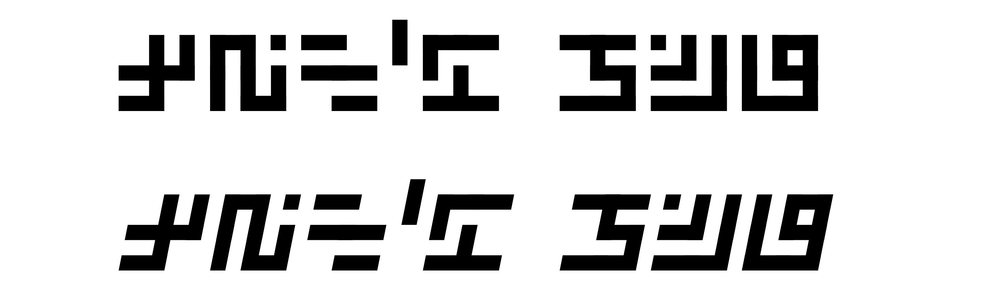

# Swastix
A blocky writing system inspired by the memorable design of Adolf Hitler, a mid-century [Austrian artist](https://en.wikipedia.org/wiki/Paintings_by_Adolf_Hitler) better known for other work.

Although independently invented, it is essentially identical to a writing system by [u/Oshimimers321](https://reddit.com/user/Oshimimers321), as implemented [here](https://scorupa.github.io/neography/).

⚠️ **WARNING:** This script may be illegal to use outside the United States of America.
